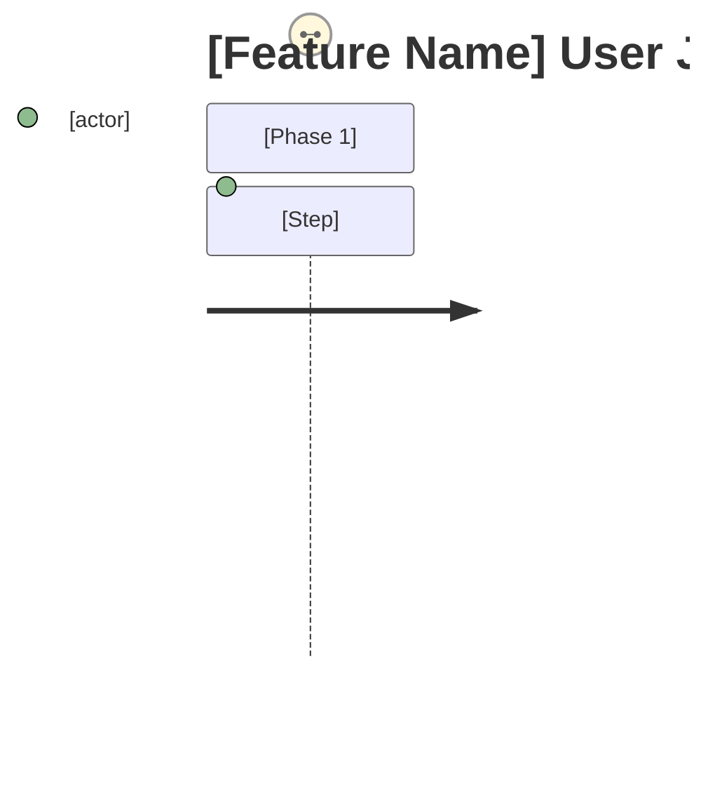

# PRD: [Feature Name]

## Overview

### One-line Summary

[Describe this feature in one line]

### Background

[Why is this feature needed? What problem does it solve?]

## User Stories

### Primary Users

[Define the main target users]

### User Stories

```
As a [user type]
I want to [goal/desire]
So that [expected value/benefit]
```

### Use Cases

1. [Specific usage scenario 1]
2. [Specific usage scenario 2]
3. [Specific usage scenario 3]

### User Journey Diagram



[Map the end-to-end user experience from trigger event to goal completion]

### Scope Boundary Diagram

```mermaid
C4Context
    Boundary(scope, "In Scope") {
        [Components in scope]
    }
    Boundary(out, "Out of Scope") {
        [Components out of scope]
    }
```

[Clarify what is and is not included in this feature]

## Functional Requirements

### Must Have (P1 - MVP)

- [ ] Requirement 1: [Detailed description]
  - AC-001: [Acceptance criteria - Given/When/Then format or measurable standard]
  - AC-002: [Acceptance criteria]
- [ ] Requirement 2: [Detailed description]
  - AC-003: [Acceptance criteria]

### Should Have (P2)

- [ ] Requirement 1: [Detailed description]
  - AC-004: [Acceptance criteria]

### Could Have (P3)

- [ ] Requirement 1: [Detailed description]

### Won't Have (this release)

- Item 1: [Description and reason for exclusion]
- Item 2: [Description and reason for exclusion]

## Non-Functional Requirements

### Performance

- Response Time: [Target value]
- Throughput: [Target value]
- Concurrency: [Target value]

### Reliability

- Availability: [Target value]
- Error Rate: [Target value]

### Security

- [Security requirements details]

### Scalability

- [Considerations for future scaling]

### Accessibility (when feature includes UI)

- Compliance standard: [Default: WCAG 2.1 AA (use organization standard if available)]
- Target assistive technologies: [Screen reader, keyboard operation, voice control, etc.]
- Platform requirements: [e.g., app store review requirements]
- Known constraints: [e.g., external library limitations]

## Success Criteria

### Quantitative Metrics

1. [Metric name]: [numeric target] measured by [method] within [timeframe]
2. [Metric name]: [numeric target] measured by [method] within [timeframe]
3. [Metric name]: [numeric target] measured by [method] within [timeframe]

### Qualitative Metrics

1. [User experience metric 1]
2. [User experience metric 2]

### UI Quality Metrics (when feature includes UI)

1. [Key operation completion rate / error recovery rate / retry success rate]
2. [Accessibility audit target score]

## Technical Considerations

### Dependencies

- [Dependencies on existing systems]
- [Dependencies on external services]

### Constraints

- [Technical constraints]
- [Resource constraints]

### Assumptions

- [Prerequisite requiring validation 1]
- [Prerequisite requiring validation 2]

### Risks and Mitigation

| Risk     | Impact          | Probability     | Mitigation       |
| -------- | --------------- | --------------- | ---------------- |
| [Risk 1] | High/Medium/Low | High/Medium/Low | [Countermeasure] |
| [Risk 2] | High/Medium/Low | High/Medium/Low | [Countermeasure] |

## Undetermined Items

- [ ] [Question 1]: [Description of options or impacts]
- [ ] [Question 2]: [Description of options or impacts]

_Discuss with user until this section is empty, then delete after confirmation_

## Appendix

### References

- [Related document 1]
- [Related document 2]

### Glossary

- **Term 1**: [Definition]
- **Term 2**: [Definition]
